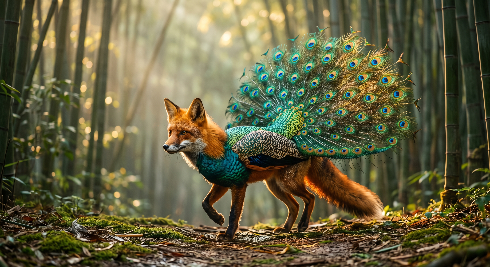
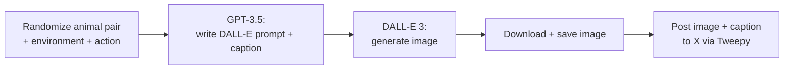

# AI-Generated Hybrid Animals

An end-to-end content pipeline: an LLM writes an image prompt and social caption for a randomly generated hybrid-animal concept, an image model renders it, and the result is auto-posted to X (Twitter) with the caption and hashtags attached.

---

## Example Output



---

## How It Works

1. **Randomize a concept** — Randomly picks two distinct animals, an environment, and an action from curated word lists (e.g. "a hybrid between a *lynx* and a *narwhal*, in a *fjord*, *gliding*")
2. **Prompt generation** — Sends the concept to GPT-3.5 to write a detailed DALL·E image prompt plus a Twitter-ready caption (≤185 characters), in a single structured response
3. **Image generation** — Feeds the generated prompt to DALL·E 3 and downloads the resulting image
4. **Publish** — Uploads the image and posts the caption + hashtags to X via the Tweepy API



---

## Repo Structure

```
ai_generated_hybrid_animals/
├── main.py             # Randomize → prompt → generate → post
└── example_output.jpg  # Sample generated image
```

---

## Key Technical Decisions

**Single LLM call for both prompt and caption** — Rather than two separate API calls, one GPT-3.5 request returns a structured `Dall-E prompt: ... Caption: ...` response that's parsed client-side, reducing latency and cost per run.

**Curated word lists over open-ended randomness** — Animals, environments, and actions are drawn from hand-picked lists rather than left fully open to the LLM, keeping output visually coherent and avoiding degenerate/duplicate combinations (the two animals are also guaranteed distinct).

**Credentials via environment variables** — OpenAI and X API keys are loaded from environment variables via `python-dotenv`, never hardcoded.

---

## Configuration

| Variable | Description |
|---|---|
| `OPEN_AI_API_KEY` | OpenAI API key (GPT-3.5 + DALL·E 3) |
| `X_API_KEY` | X (Twitter) API key |
| `X_API_SECRET_KEY` | X API secret key |
| `X_BEARER_TOKEN` | X bearer token |
| `X_ACCESS_TOKEN` | X access token |
| `X_ACCESS_TOKEN_SECRET` | X access token secret |
