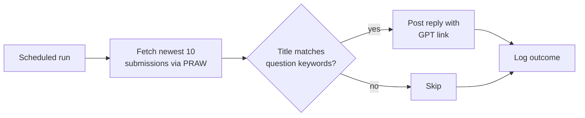

# Reddit AI Assistant Bot

A scheduled bot that scans a subreddit for question-shaped posts and replies with a link to a custom GPT trained on that community's knowledge base — built for r/StardewValley, pointing users to a Stardew Valley Wiki-powered assistant.

---

## How It Works

On each run, the bot:

1. Pulls the 10 newest submissions from the target subreddit via **PRAW** (Python Reddit API Wrapper)
2. Flags any post whose title matches a question-keyword list (`?`, `help`, `what`, `how`, `where`, `why`, `can't`, etc.)
3. Replies to each match with a link to the custom GPT
4. Logs every reply (and any errors) to `bot_log.log` for later review



---

## Repo Structure

```
reddit_ai_assistant_bot/
└── main.py    # Fetch, match, reply, log
```

---

## Key Technical Decisions

**Keyword matching over the Reddit API's own search** — Scanning the newest N submissions directly (rather than querying Reddit's search endpoint) keeps the bot simple and avoids search-index lag, at the cost of only catching posts within the most recent window per run — acceptable for a moderately active subreddit polled on a schedule.

**Per-post try/except** — Each submission is processed in its own `try/except` so one malformed post (deleted mid-scan, API hiccup) doesn't take down the rest of the batch; errors are logged with the submission ID for follow-up.

**Credentials via environment variables** — All Reddit API credentials (`client_id`, `client_secret`, `username`, `password`, `user_agent`) are loaded from environment variables via `python-dotenv`, never hardcoded.

---

## Configuration

| Variable | Description |
|---|---|
| `REDDIT_CLIENT_ID` | Reddit app client ID |
| `REDDIT_CLIENT_SECRET` | Reddit app client secret |
| `REDDIT_USER_AGENT` | User agent string identifying the bot |
| `REDDIT_USERNAME` | Bot account username |
| `REDDIT_PASSWORD` | Bot account password |
