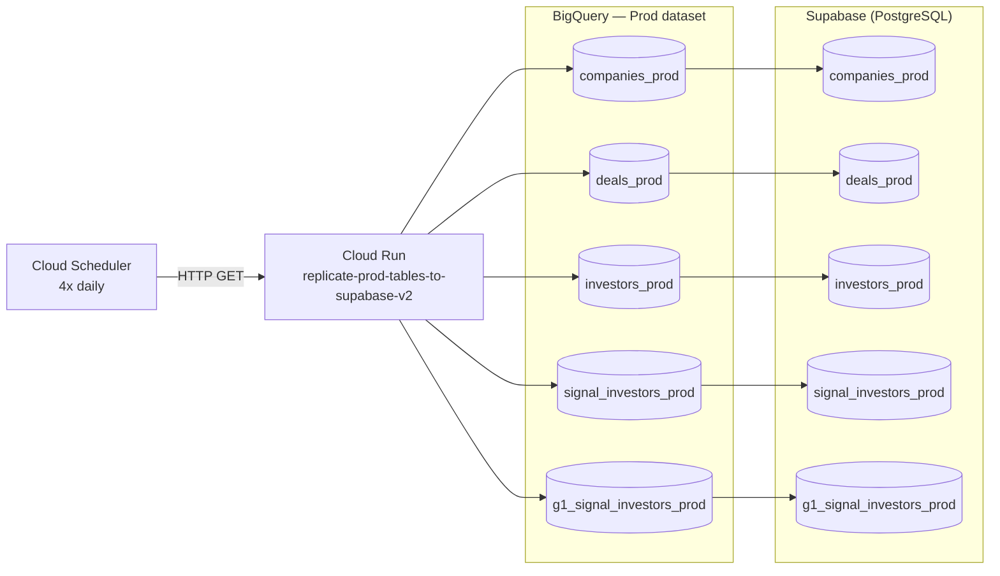

# BigQuery → Supabase Sync

A scheduled Cloud Run service that replicates production BigQuery tables into a **Supabase (PostgreSQL)** database four times daily, keeping a live Postgres replica in sync for downstream consumers.

---

## Pipeline Overview

### 1. Scheduling — Cloud Scheduler
A Cloud Scheduler job fires four times daily (1am, 7am, 1pm, 7pm CT) and sends an HTTP GET to the Cloud Run service endpoint.

See [`scheduling/triggers.md`](scheduling/triggers.md) for the full trigger setup.

### 2. Sync — Cloud Run Service
On each invocation the service acquires an in-process lock (skips immediately if a sync is already running), then for each table:

1. **Schema sync** — Fetches the BigQuery table schema and creates the Supabase table if it doesn't exist. Any columns present in BigQuery but missing from Supabase are added via `ALTER TABLE`. Columns that exist only in Supabase are never touched.
2. **Upsert** — Reads all rows from the BigQuery `Prod.*` view and batch-upserts them into Supabase using `INSERT ... ON CONFLICT DO UPDATE`, in chunks of 2,000 rows.
3. **Stale row deletion** — Compares primary keys between BigQuery and Supabase and deletes any rows that no longer exist in BigQuery.

Tables synced:

| BigQuery source | Supabase table | Primary key |
|---|---|---|
| `Prod.companies_prod` | `companies_prod` | `company_id` |
| `Prod.deals_prod` | `deals_prod` | `deal_id` |
| `Prod.investors_prod` | `investors_prod` | `investor_id` |
| `Prod.signal_investors_prod` | `signal_investors_prod` | `investor_id` |
| `Prod.g1_signal_investors_prod` | `g1_signal_investors_prod` | `investor_id` |

The service returns a JSON summary of row counts and status per table.

---

## Architecture



---

## Repo Structure

```
bq_to_supabase_sync/
├── README.md
├── scheduling/
│   └── triggers.md                                     # Cloud Scheduler job setup
└── cloud_run_services/
    └── replicate_prod_tables_to_supabase/
        ├── main.py                                     # Sync handler + schema migration logic
        ├── requirements.txt
        └── service.yaml                               # Cloud Run service spec
```

---

## Key Technical Decisions

**In-process mutex instead of a queue** — `threading.Lock(blocking=False)` means a second invocation that arrives while a sync is in progress returns `{"status": "skipped"}` immediately rather than queuing. This prevents pile-ups if a sync takes longer than the scheduler interval without needing any external coordination.

**`containerConcurrency: 1`** — Cloud Run is configured to send at most one request at a time to each container instance. Combined with the in-process lock, this makes double-processing impossible even if Cloud Run spins up multiple instances.

**Schema-forward migration** — The service reads the live BigQuery schema on every run and `ALTER TABLE ... ADD COLUMN` for any new fields. New columns added to BigQuery prod views automatically appear in Supabase on the next sync with no manual migration.

**Supabase-only columns are preserved** — The migration only adds columns, never drops them. Columns added directly in Supabase (e.g., app-layer fields, computed columns) survive pipeline runs untouched.

**Full-table upsert with stale deletion** — Rather than a watermark-based incremental sync, each run does a full read of BigQuery and a full upsert into Supabase. This keeps the logic simple and self-healing: any row that was incorrectly deleted or corrupted in Supabase will be restored on the next run. Stale rows (deleted from BigQuery) are cleaned up by diffing primary key sets.

**Batched writes (2,000 rows)** — Upserts and deletes are chunked to avoid hitting Postgres statement size limits and to keep individual transactions short, reducing lock contention.

**`statement_timeout = 300s`** — Set on the Postgres connection at startup to bound the worst-case duration of any single statement, preventing runaway queries from blocking Supabase indefinitely.

**BQ type mapping to Postgres** — A static `BQ_TO_PG_TYPE` map translates BigQuery field types to their Postgres equivalents at schema-sync time (e.g. `TIMESTAMP → TIMESTAMPTZ`, `RECORD/STRUCT → JSONB`, `GEOGRAPHY → TEXT`).

---

## Configuration

| Variable | Description |
|---|---|
| `SUPABASE_DB_PASSWORD` | Password for the Supabase PostgreSQL connection |
