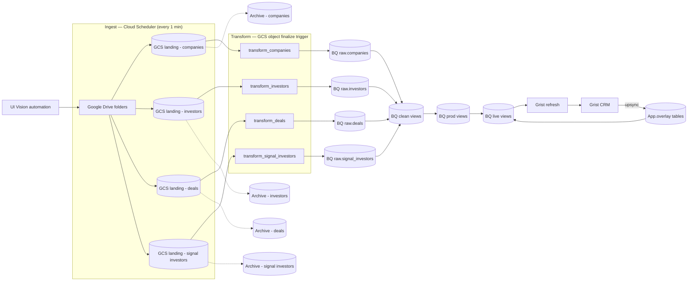

# PitchBook CRM Pipeline

An event-driven ETL pipeline on **Google Cloud Platform** that automates the ingestion of PitchBook Excel exports into **BigQuery** and **Grist CRM** for downstream analytics and deal-flow tracking.

---

## Pipeline Overview

### 1. Extraction — UI Vision Automation
A UI Vision macro (`ui_automation/pitchbook_export_automation.json`) drives the browser to download four PitchBook Excel reports from a saved search:

- Companies
- Investors
- Deals
- Signal Investors

Each export is downloaded, renamed by domain, and moved to a local output folder that syncs to Google Drive.

### 2. Ingestion — Cloud Run + Cloud Scheduler
Four Cloud Run services (`cloud_run_services/process_*_drive/`) are triggered every minute by **Cloud Scheduler**. Each service:

- Lists all files in a watched Google Drive folder
- Resolves Drive shortcuts to their real targets
- Downloads the file (exporting Google Workspace formats to `.xlsx`/`.pdf` as needed)
- Uploads the file directly to the GCS landing bucket
- Permanently deletes the original from Drive (with trash fallback if delete is not permitted)
- Skips subfolders

See [`scheduling/triggers.md`](scheduling/triggers.md) for the full trigger setup.

### 3. Transformation — GCS Object Finalize Trigger
A `google.storage.object.finalize` event on each landing bucket fires a Pub/Sub notification that triggers a per-domain Cloud Run service (`cloud_run_services/process_*_bucket/`). Each service runs two steps in sequence:

**Step 1 — `*_gcs_to_bq.py` (GCS → BigQuery):**
- Downloads the `.xlsx` from the landing bucket
- Strips PitchBook's multi-row customer-facing headers (header row index 7)
- Sanitizes column names (lowercase, snake_case, strips zero-width chars/BOM/forbidden chars)
- Appends cleaned rows to a BigQuery raw table with `WRITE_APPEND` + `ALLOW_FIELD_ADDITION`
- Uploads a sidecar `.columns.json` to the archive bucket (original → snake column map)
- Moves the source file to the archive bucket and deletes it from landing
- Uses GCS object-generation-matched lock files + DONE markers to handle at-least-once delivery safely

**Step 2 — `*_grist_refresh.py` (BigQuery → Grist):**
- Queries the `live` view (prod + overlay) from BigQuery
- Builds a key index from existing Grist records
- Incrementally patches changed records and inserts new ones using parallel batched workers
- Persists a watermark in GCS to support paged/resumable syncs across invocations
- Optionally upsyncs custom Grist fields back to the `App.overlay_*` table in BigQuery (enabled via `UPSYNC_OVERLAY=1`)

The `App` dataset is written exclusively by the upsync path — it holds manually maintained CRM annotations entered in Grist, mirrored back to BigQuery so the `live` views can join them with the `prod` data.

### 4. Modeling — BigQuery Views
SQL views in the `clean` dataset transform the raw append tables into deduplicated, properly-typed, analysis-ready datasets. Each view:

- Casts all numeric and timestamp fields out of the raw `STRING` schema
- Strips PitchBook copyright footer rows that arrive in the export
- Deduplicates by entity ID, keeping the most recent ingestion via `QUALIFY ROW_NUMBER() OVER (...) = 1`
- Applies business-logic filters where appropriate (e.g. `investors_clean` excludes non-VC investor types, inactive statuses, and non-target geographies)

Views are organized across three layers — `clean → prod → live` — each building on the previous:

| Layer | Dataset | Purpose |
|---|---|---|
| `clean` | `Clean` | Type casting, deduplication, copyright row removal, basic filtering |
| `prod` | `Prod` | Business logic — signal matching, stage classification, deal scoring, co-investment metrics |
| `live` | `Live` | Joins `prod` with `App.overlay_*` (custom Grist fields upsynced back to BQ) — this is what the Grist refresh queries, so user annotations survive pipeline refreshes |

SQL lives in [`bigquery_views/clean/`](bigquery_views/clean/), [`bigquery_views/prod/`](bigquery_views/prod/), and [`bigquery_views/live/`](bigquery_views/live/). The `live` views are what the batch loader queries when syncing to Grist.

### 5. Delivery — Grist Refresh (triggered inline)
After a successful BigQuery load, the same Cloud Run service triggers a Grist sync (`*_grist_refresh.py`):

- Queries the `Live.*` BigQuery view (`Prod.*` joined with `App.overlay_*`)
- Builds a key index from existing Grist records and incrementally patches/inserts changes
- Optionally upsyncs custom Grist fields back to `App.overlay_*` in BigQuery (`UPSYNC_OVERLAY=1`)

The `Live` layer is what makes the bidirectional sync safe: users can add custom columns in Grist (notes, status flags, relationship tracking, etc.), the upsync writes those back to `App.overlay_*`, and because the refresh queries `Live.*` rather than `Prod.*` directly, those custom fields survive the next pipeline run instead of being overwritten.

---

## Architecture



---

## Repo Structure

```
pitchbook_crm_pipeline/
├── README.md
├── ui_automation/
│   └── pitchbook_export_automation.json        # UI Vision macro for PitchBook exports
├── scheduling/
│   └── triggers.md                             # Cloud Scheduler + GCS trigger setup
├── cloud_run_services/
│   ├── process_companies_drive/                # Cloud Scheduler target — Drive → GCS landing
│   │   ├── main.py
│   │   ├── requirements.txt
│   │   └── service.yaml
│   ├── process_deals_drive/
│   │   ├── main.py
│   │   ├── requirements.txt
│   │   └── service.yaml
│   ├── process_investors_drive/
│   │   ├── main.py
│   │   ├── requirements.txt
│   │   └── service.yaml
│   ├── process_signal_investors_drive/
│   │   ├── main.py
│   │   ├── requirements.txt
│   │   └── service.yaml
│   ├── process_companies_bucket/               # GCS finalize trigger — XLSX → BQ → Grist
│   │   ├── main.py                             # Event handler + pipeline orchestration
│   │   ├── companies_gcs_to_bq.py              # XLSX → BigQuery raw (with HYPERLINK extraction)
│   │   ├── companies_grist_refresh.py          # BigQuery live view → Grist (incremental sync)
│   │   ├── requirements.txt
│   │   └── service.yaml                        # Cloud Run service spec
│   ├── process_deals_bucket/
│   │   ├── main.py
│   │   ├── deals_gcs_to_bq.py
│   │   ├── deals_grist_refresh.py
│   │   ├── requirements.txt
│   │   └── service.yaml
│   ├── process_investors_bucket/
│   │   ├── main.py
│   │   ├── investors_gcs_to_bq.py
│   │   ├── investors_grist_refresh.py
│   │   ├── requirements.txt
│   │   └── service.yaml
│   └── process_signal_investors_bucket/
│       ├── main.py
│       ├── signal_investors_gcs_to_bq.py
│       ├── signal_investors_grist_refresh.py
│       ├── requirements.txt
│       └── service.yaml
└── bigquery_views/
    ├── clean/                                  # Raw → typed, deduplicated, filtered
    │   ├── companies_clean.sql
    │   ├── deals_clean.sql
    │   ├── investors_clean.sql
    │   └── signal_investors_clean.sql
    ├── prod/                                   # Business logic — signal flags, stage buckets, metrics
    │   ├── companies_prod.sql
    │   ├── deals_prod.sql
    │   ├── investors_prod.sql
    │   ├── signal_investors_prod.sql
    │   └── g1_signal_investors_prod.sql
    └── live/                                   # Prod + App overlay (synced to Grist)
        ├── companies.sql
        ├── deals.sql
        ├── investors.sql
        ├── signal_investors.sql
        └── g1_signal_investors.sql
```

---

## Key Technical Decisions

**Event-driven transform (GCS finalize trigger)** — The transform service only runs when a file actually lands in the bucket. No polling, no wasted invocations.

**Cloud Scheduler at 1-minute cadence** — The UI Vision automation runs ad-hoc. Polling Drive every minute keeps end-to-end latency under 60 seconds without needing a Drive push notification integration.

**`QUALIFY ROW_NUMBER()` deduplication in views** — Raw tables are append-only. The clean views always surface the latest ingestion of each entity, making the downstream Grist sync idempotent regardless of how many times a file was re-exported.

**Investor filtering in `investors_clean`** — The raw export includes every investor type. The clean view filters out non-VC types (PE/Buyout, Family Office, Corporate VC, etc.), inactive statuses, and non-target regions (Africa, Asia, Oceania) so the CRM only surfaces actionable targets.

**GCS generation-matched locking** — Each file is identified by `(blob_name, generation)`. The service writes a lock object using `if_generation_match=0` so only one concurrent invocation can proceed. A separate DONE marker is written only after the full pipeline (BQ load + Grist sync) succeeds, making re-delivery safe.

**DONE marker written after Grist, not after BQ** — If Grist refresh fails, the DONE marker is not written. The next GCS event retry will skip BQ (already archived) but re-attempt Grist. This prevents data duplication while still recovering from Grist failures.

**Incremental Grist sync with GCS-persisted watermark** — The Grist refresh uses `ingested_at` as a watermark stored in a GCS state file. Each invocation picks up where the last left off, keeping syncs fast even as the BigQuery table grows.

**Parallel patch workers grouped by field signature** — Records being patched to Grist are bucketed by their set of fields, then patched in parallel per bucket. This avoids Grist rejecting PATCH requests where records have different field sets.

**Upsync: Grist → BigQuery overlay** — When `UPSYNC_OVERLAY=1`, custom fields added to Grist (CRM annotations, status flags) are mirrored back to `App.overlay_*` tables in BigQuery via a MERGE. The `live` views join these overlays with `prod`, keeping the full dataset available for SQL queries without leaving data stranded in Grist.

**HYPERLINK formula extraction (companies only)** — PitchBook's companies export stores website URLs as `=HYPERLINK("url","text")` Excel formulas. `pandas` reads only the display text; `companies_gcs_to_bq.py` opens the workbook with `openpyxl` and extracts the actual URL for each row.

**Archive-on-success** — Files are copied to the archive bucket and deleted from landing only after a successful BigQuery load, preventing data loss on partial failures.

---

## Configuration

All secrets and environment-specific values are passed via environment variables:

| Variable | Description |
|---|---|
| `GCP_PROJECT_ID` | GCP project ID |
| `SOURCE_BUCKET` | GCS landing bucket name |
| `ARCHIVE_BUCKET` | GCS archive bucket name |
| `TARGET_DATASET` | BigQuery dataset |
| `TARGET_TABLE` | BigQuery table |
| `EXCEL_HEADER_ROW` | 0-based row index of the header in PitchBook exports (default: 7) |
| `GRIST_API_KEY` | Grist API key |
| `GRIST_HOST` | Grist instance URL |
| `GRIST_DOC_ID` | Grist document ID |
| `GRIST_TABLE_ID` | Grist table ID |
| `BQ_QUERY` | SQL query used to fetch rows for Grist sync |
